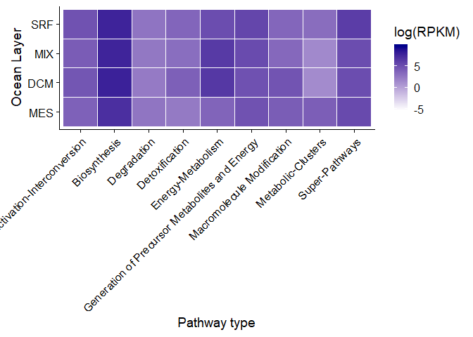

Data set exploration
================
Javier Castillo-Arnemann
October 12, 2018

Exploratory data analysis
-------------------------

``` r
suppressPackageStartupMessages(library(tidyverse))

dataset <- read_tsv("df_MASTERTABLE.txt") %>%
  group_by(SAMPLE) %>%
  mutate(n_samples = n())
```

    ## Parsed with column specification:
    ## cols(
    ##   .default = col_character(),
    ##   ORF_COUNT = col_integer(),
    ##   RPKM = col_double(),
    ##   LEVEL1ORDER = col_integer(),
    ##   PWYORDER = col_integer(),
    ##   LEVEL2ORDER = col_integer(),
    ##   DEPTHM = col_integer(),
    ##   LAT = col_double(),
    ##   LONG = col_double()
    ## )

    ## See spec(...) for full column specifications.

    ## Warning in rbind(names(probs), probs_f): number of columns of result is not
    ## a multiple of vector length (arg 1)

    ## Warning: 24717 parsing failures.
    ## row # A tibble: 5 x 5 col      row col    expected   actual file                 expected    <int> <chr>  <chr>      <chr>  <chr>                actual 1 108759 DEPTHM an integer MULTI  'df_MASTERTABLE.txt' file 2 108759 LAT    a double   MULTI  'df_MASTERTABLE.txt' row 3 108759 LONG   a double   MULTI  'df_MASTERTABLE.txt' col 4 108760 DEPTHM an integer MULTI  'df_MASTERTABLE.txt' expected 5 108760 LAT    a double   MULTI  'df_MASTERTABLE.txt'
    ## ... ................. ... ...................................................... ........ ...................................................... ...... ...................................................... .... ...................................................... ... ...................................................... ... ...................................................... ........ ......................................................
    ## See problems(...) for more details.

``` r
n_distinct(dataset$SAMPLE) #total number of samples
```

    ## [1] 299

``` r
#Region vs biome
dataset %>%
  ggplot(aes(BIOME, DEPTHM)) +
  geom_point() +
  theme(axis.text.x = element_text(angle = 90, hjust = 1)) +
  scale_y_reverse()
```

    ## Warning: Removed 8239 rows containing missing values (geom_point).


``` r
#Depth vs region
dataset %>%
  ggplot(aes(GEOREGION, DEPTHM)) +
  geom_point() +
  theme(axis.text.x = element_text(angle = 90, hjust = 1))
```

    ## Warning: Removed 8239 rows containing missing values (geom_point).



``` r
#Combine LAT LON
dataset$LOC <- paste(dataset$LAT, dataset$LONG, sep = ", ")

#Find how many samples are in every location
samples_per_loc <- dataset %>% 
  group_by(LOC) %>%
  summarize(samples_per_loc = n_distinct(SAMPLE))
```
